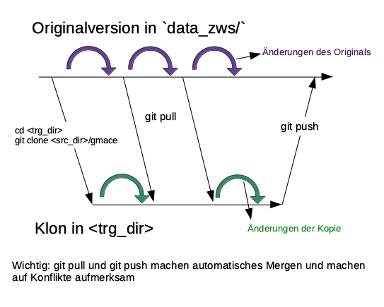

Use Case Für Änderungen in den data\_zws Directories
================

## Hintergrund

Kleine Änderungen bei Programmen oder Parameterdateien können direkt in
der produktiven Umgebung von `data_zws` gemacht werden. Wichtig ist
dabei die Änderungen in `git` mit einem `git commit` festzuschreiben.

Bei grösseren Änderungen, wie bei der Umstellung auf den
Singularity-Container sind viele Sourcefiles und viele Parameterdateien
betroffen. Zudem bestehen Abhängigkeiten zwischen den verschiedenen
Sourcen und Parameterdateien. Durch diese Abhängigkeiten kann die
Komplexität und die Fehleranfälligkeit sehr schnell zunehmen.

An einem konkreten Use-Case für eine Änderung aufgrund der Lösung eines
Problems soll im Folgenden gezeigt werden.

## Manuelle Umsetzung

Eine einfache und naheliegende Umsetzung für eine grössere Änderung an
den Sourcefiles kann sicher über ein manuelles Kopieren der Sourcefiles
in ein neues Directory unter `/qualstorzws01/data_projekte/projekte`
umgesetzt werden. Ein Beispiel dafür ist
`/qualstorzws01/data_projekte/projekte/singularity_data_zws`. Das
Problem mit dieser Lösung ist, dass die Versionen bei längerer Dauer der
Test- oder Entwicklungsphase divergieren können. Mit zunehmender
Divergenz wird es schwierig und mühsam die Versionen wieder
zusammenzubringen (merge). Auch wenn während der Test- oder
Entwicklungsphase kein Merge nötig ist, muss zum Abschluss ja trotzdem
die manuelle Kopie wieder zurück ins Original gemerged werden. Obwohl
das nur eine einmalige Operation ist, kann dies eine sehr schwierige
Aufgabe sein und ohne Unterstützung von Tools können sehr leicht
Änderungen vergessen gehen. Die nachfolgende Darstellung soll die
manuelle Umsetzung veranschaulichen.

<!-- -->

## Verwendung von git

Vorausgesetzt, dass die Originalversion mit `git` versioniert ist,
können wir `git clone` verwenden um einen Klon für die Test- und
Entwicklungsphase zu erstellen. Die Aktualisierungs- und Merge-Prozesse
können dann mit `git pull` und mit `git push` erledigt werden. Die
Struktur der ausgeführten Operationen sieht ähnlich aus, wie bei der
manuellen Umsetzung. Der Vorteil bei der Verwendung von git ist die
Unterstützung der Kopier- und Mergeoperationen, so dass diese möglichst
fehlerfrei ablaufen können. In der folgenden Darstellung werden die
Operationen mit git ausgeführt.

<!-- -->

## Use-Case

In diesem use-case soll an einem konkreten Beispiel gezeigt werden, wie
eine Anpassung an Sourcefiles mit der Verwendung von `git` umgesetzt
werden kann. Die Änderung ist nicht gross und hätte direkt ohne
Erstellung eines Klons realisiert werden können. Als Demonstration wird
aber trotzdem der Weg über das Erstellen eines Klons gewählt.

Im hier gezeigten Beispiel geht es darum, dass in zwei Bash-Skripts in
der Verarbeitung der GMACE-Zuchtwerte eine Variable von `runDesignation`
zu `runDesignationGE` geändert werden muss. Während die Verarbeitung der
GMACE-Zuchtwerte im Verzeichnis `data_zws/gmace` gemacht wird, werden
die Inputparameter aus der Verarbeitung der MACE-Zuchtwerte in
`data_zws/itb` verwendet. Somit haben wir ein sehr kleines Beispiel,
welches aber doch Abhängigkeiten zwischen zwei Routine-Projekten (gmace
und itb) aufweist. Da zur Verarbeitung der GMACE-Zuchtwerte auch
Fortran-Programme verwendet werden, besteht auch eine Abhängigkeit zu
den Modulen in `/qualstorzws01/data_zws/f90_modules`.

Im Folgenden wird die Verwendung von git in einen schrittweisen Vorgehen
beschrieben. Dazu verwenden wir die folgenden Begriffe. Die Originale
oder die Sourcefiles befinden sich in den Verzeichnissen
`/qualstorzws01/data_zws/{gmace,itb}`. Die Klone werden unter dem
Verzeichnis `/qualstorzws01/data_projekte/projekte/gmace-fix` erstellt.

### Schritt 1: Vorbereitung der Originale

Als Vorbereitung müssen in den Originalverzeichnissen alle Änderungen
festgeschrieben sein. Zusätzlich muss noch die Konfiguration der
Repositories angepasst werden, damit wir von den später erstellten Klons
zurückpushen können. Diese Vorbereitung ist für `gmace` und `itb`
gezeigt.

    # Vorbereitung in gmace
    cd /qualstorzws01/data_zws/gmace
    git commit -m"Kommentar zur Aenderung in gmace"
    git config --local receive.denyCurrentBranch updateInstead
    
    # Vorbereitung in itb
    cd /qualstorzws01/data_zws/itb
    git commit -m"Kommentar zur Aenderung in itb"
    git config --local receive.denyCurrentBranch updateInstead
    
    # Vorbereitung der f90_modules
    cd /qualstorzws01/data_zws/f90_modules
    git commit -m"Kommentar zur Aenderung in f90_modules"

### Schritt 2: Erstellen der Klone

Die Klone werden in einem neuen Verzeichnis erstellt.

    # Verzeichnis erstellen
    cd /qualstorzws01/data_projekte/projekte
    mkdir gmace-fix
    cd gmace-fix
    
    # Klone erstellen
    git clone /qualstorzws01/data_zws/gmace
    git clone /qualstorzws01/data_zws/itb
    git clone /qualstorzws01/data_zws/f90_modules

### Schritt 3: Änderungen

Die nötigen Änderungen werden in den Skripten von
`/qualstorzws01/data_projekte/projekte/gmace-fix/gmace/prog` und am
Parameterfile von
`/qualstorzws01/data_projekte/projekte/gmace-fix/itb/par/par.par`
gemacht. Dies wird hier nicht gezeigt. Nach den Änderungen werden diese
im Klon-Repository festgeschrieben.

    # commit gmace
    cd /qualstorzws01/data_projekte/projekte/gmace-fix/gmace
    git commit -m"Aenderung der Skripte"
    
    # commit itb
    cd /qualstorzws01/data_projekte/projekte/gmace-fix/itb
    git commit -m"Aenderung des parfiles"

### Schritt 4: Tests

In diesem Schritt werden die Änderungen unter
`/qualstorzws01/data_projekte/projekte/gmace-fix` getestet. Das wird
hier nicht gezeigt.

### Schritt 5: Push

Sobald die Tests erfolgreich sind. Dann müssen wir die Klone zurück ins
Original mergen.

    # gmace push
    cd /qualstorzws01/data_projekte/projekte/gmace-fix/gmace
    git push
    
    # itb
    cd /qualstorzws01/data_projekte/projekte/gmace-fix/itb
    git push

Das Pushen funktioniert, falls es zwischen Original und Klon keine
Konflikte gibt, welche durch das automatische Mergen nicht aufgelöst
werden können. Falls Konflikte angezeigt werden, dann müssen diese
manuell aufgelöst werden.

### Schritt 6: Clean Up

Als letzten Schritt können wir das Verzeichnis mit den Klons entweder
archivieren oder löschen.

    rm -rf /qualstorzws01/data_projekte/projekte/gmace-fix
